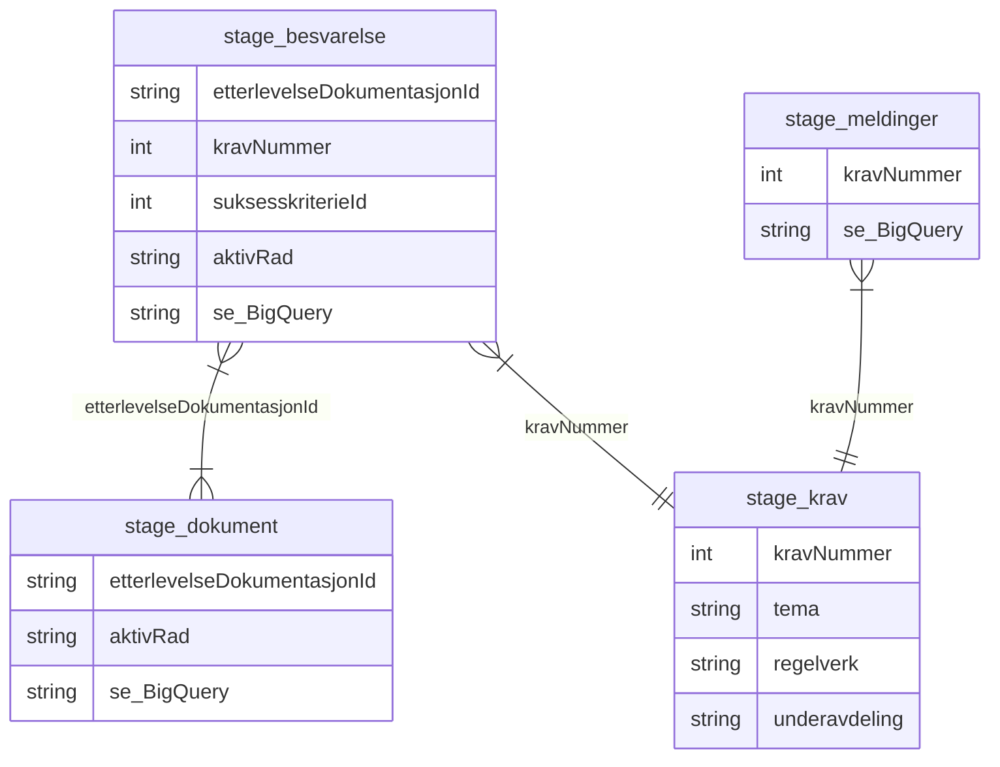

# Metrics Datajegerne

Henter og transformerer data fra Støtte til Etterlevelse.

Dataene brukes til å forstå hvordan folk bruker verktøyet.

Data fra Postgres i Etterlevelse transformeres og lastes til "staging" med scheduled query. 
Jobbene henter data fra følgende tabeller:
- Generic storage
- codelist
- audit version

Modellen ser sånn ut:

