# Metrics Datajegerne

Henter og transformerer data fra Støtte til Etterlevelse og Behandlingskatalogen. Dataene brukes til å forstå hvordan folk bruker verktøyene.

Alle lenkene under her er interne lenker som forutsetter tilgang til GCP-prosjektet til Datajegerne. 

Koden i main.py henter data fra en BigQuery-collection kalt "landing_zone": [landing_zone i BigQuery](https://console.cloud.google.com/bigquery?inv=1&invt=Abp_dA&project=teamdatajegerne-prod-c8b1&ws=!1m4!1m3!3m2!1steamdatajegerne-prod-c8b1!2slanding_zone). I landing_zone ligger data hentet fra Støtte til Etterlevelse og Behandlingskatalogen. [Federated queries som brukes til å laste data fra Postgres til BigQuery ligger her](https://console.cloud.google.com/bigquery/scheduled-queries?inv=1&invt=Abp_dA&project=teamdatajegerne-prod-c8b1).

Tabellene bearbeides så videre til tabeller som er prefixet med "stage". Noen tabeller bearbeides videre til datasett som deles på Markedsplassen. Disse prefixes med "ds". Noen av disse datasettene er enkle views opprettet i cloud-consolet.

Tabellene finner du her:
- [Etterlevelse](https://console.cloud.google.com/bigquery?inv=1&invt=Abp_dA&project=teamdatajegerne-prod-c8b1&ws=!1m4!1m3!3m2!1steamdatajegerne-prod-c8b1!2setterlevelse)
- [Behandlingskatalogen](https://console.cloud.google.com/bigquery?inv=1&invt=Abp_dA&project=teamdatajegerne-prod-c8b1&ws=!1m4!1m3!3m2!1steamdatajegerne-prod-c8b1!2sbehandlinger)

Modellen ser slik ut:

```mermaid
erDiagram
    stage_besvarelse }|--|{ stage_dokument : etterlevelseDokumentasjonId
    stage_besvarelse }|--|| stage_krav : kravNummer
    stage_meldinger }|--|| stage_krav: kravNummer
    stage_relasjoner }|--|{ stage_dokument: etterlevelseDokumentasjonIdFra
    stage_relasjoner }|--|{ stage_dokument: etterlevelseDokumentasjonIdTil

    stage_pvk_dokument ||--|| stage_dokument: etterlevelseDokumentasjonId
    stage_pvk_dokument ||--|{ stage_risikoscenario: pvkDokumentId
    stage_pvk_dokument ||--|{ stage_tiltak: pvkDokumentId

    stage_behandlinger }|--|| stage_dokument: behandlingId
    stage_policy }|--|| stage_informationType: informationTypeId
    stage_policy  ||--|| stage_bridge_policy_behandling: policyId
    stage_behandlinger ||--|{  stage_bridge_policy_behandling: behandlingId
    stage_behandlinger ||--|{  stage_dataprocessors: behandlingId
    stage_behandlinger ||--|{  stage_systems: behandlingId
    stage_behandlinger ||--|{  stage_behandlingsgrunnlag: behandlingId

    

    stage_besvarelse {
        string etterlevelseDokumentasjonId
        int kravNummer
        int suksesskriterieId
        string aktivRad
        string se_BigQuery
    }
    stage_dokument {
        string etterlevelseDokumentasjonId
        array behandlingId
        string aktivRad
        string se_BigQuery
    }
    stage_krav {
        int kravNummer
        string tema
        string regelverk
        string underavdeling

    }    
    stage_meldinger {
        int kravNummer
        string se_BigQuery
    }

    stage_relasjoner {
        string etterlevelseDokumentasjonIdFra
        string etterlevelseDokumentasjonIdTil
        string relationType
    }




    stage_pvk_dokument {
        string etterlevelseDokumentasjonId
        string pvkDokumentId
        string se_BigQuery
    }

    stage_risikoscenario {
        string risikoscenarioId
        string pvkDokumentId
        string se_BigQuery
    }

    stage_tiltak {
        string tiltakId
        string pvkDokumentId
        string se_BigQuery
    }





    stage_behandlinger {
        string behandlingId
        string se_BigQuery
    }
    stage_dataprocessors {
        string dataprocessorI
        string dbehandlingId
        string se_BigQuery
    }
    stage_systems {
        string code
        string behandlingId
        string se_BigQuery
    }
    stage_behandlingsgrunnlag {
        string behandlingId
        string se_BigQuery
    }
    stage_policy {
        string policyId
        string informationTypeId
        string se_BigQuery
    }
    stage_bridge_policy_behandling {
        string behandlingId
        string policyId
        string se_BigQuery
    }
    stage_informationType {
        string informationTypeId
        string se_BigQuery
    }
```

